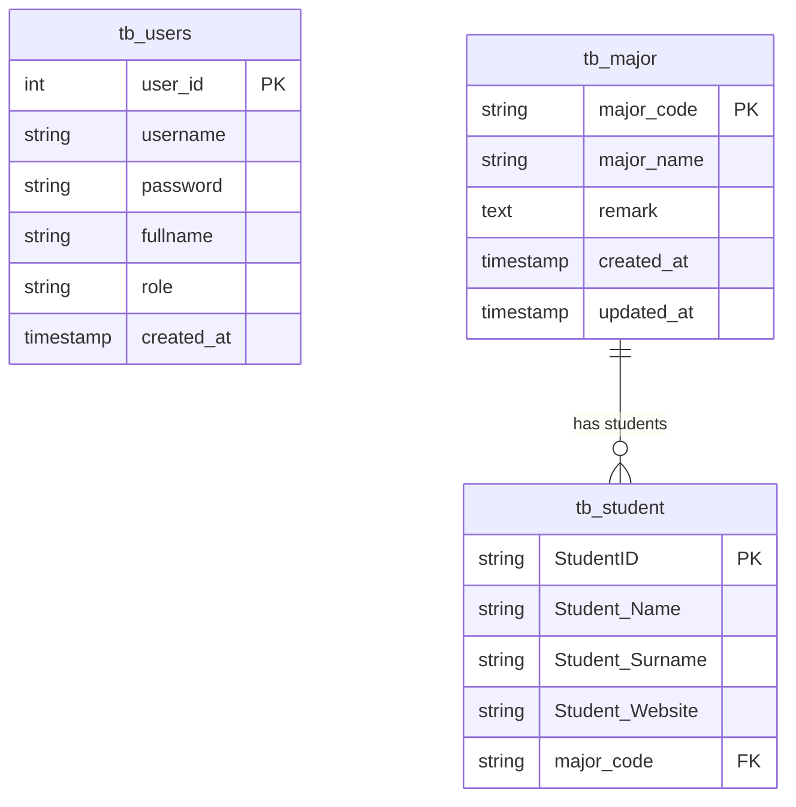

# 🎓 ระบบจัดการข้อมูลนักศึกษาและสาขาวิชา (Student & Major Management System)

ระบบจัดการข้อมูลนักศึกษาและสาขาวิชา พัฒนาด้วยภาษา **PHP** ตามสถาปัตยกรรม **Modular MVC (Model-View-Controller)** ร่วมกับ **RESTful API Backend** พร้อมระบบ **Authentication (Login/Logout)** และตกแต่งส่วนแสดงผลด้วย **Tailwind CSS v4 (Clean Light Theme)**

---

## 📌 คุณสมบัติเด่นของระบบ (Key Features)

- 🏗️ **สถาปัตยกรรม Modular MVC:** แยกหน้าที่ของแต่ละ Entity ออกจากกันอย่างชัดเจนตามหลัก Single Responsibility Principle (`StudentController`, `MajorController`, `AuthController`)
- 🔑 **ระบบยืนยันตัวตน (Authentication & Auth Guard):** ป้องกันการเข้าถึงหน้าจัดการข้อมูลก่อนเข้าสู่ระบบ พร้อมระบบ Session และการเข้ารหัสรหัสผ่านด้วย `password_hash()` (Bcrypt)
- 🌐 **RESTful API Services:** ให้บริการข้อมูลในรูปแบบ JSON ครบถ้วนทั้งนักศึกษา สาขาวิชา และการยืนยันตัวตน รองรับ HTTP Methods (`GET`, `POST`, `PUT`, `DELETE`)
- 🔀 **ระบบสลับตาราง (Table Switcher):** สลับการแสดงผลระหว่าง **ตารางนักศึกษา (`tb_student`)** และ **ตารางสาขาวิชา (`tb_major`)** ได้ทันทีในหน้าเดียว พร้อมปรับเปลี่ยนปุ่ม Action ตามบริบทตาราง
- 🪟 **Interactive Popup Modals:**
  - ℹ️ **Major Details Modal:** คลิกที่ชื่อสาขาวิชาในตารางเพื่อเปิดดูรหัสสาขา, ชื่อสาขา และหมายเหตุ
  - 🚨 **Confirm Delete Modal:** แจ้งเตือนยืนยันก่อนลบข้อมูลนักศึกษาหรือสาขาวิชา
  - 🚪 **Confirm Logout Modal:** แจ้งเตือนยืนยันก่อนออกจากระบบ
- 🎨 **Clean & Modern UI:** ดีไซน์สไตล์ Clean Light สบายตาด้วย **Tailwind CSS v4**, **FontAwesome 6** และ Google Fonts (**Prompt & Inter**)
- 🧑‍💻 **Junior Clean Code:** โครงสร้างโค้ดอ่านง่าย ตัวแปรและฟังก์ชันสื่อความหมายชัดเจน เหมาะสำหรับการเรียนรู้และพัฒนาต่อ

---

## 🗂️ โครงสร้างโปรเจกต์ (Project Structure)

```text
MVC/
├── db_student.sql                   # สคริปต์สร้างฐานข้อมูล (tb_users, tb_major, tb_student)
├── README.md                        # เอกสารคู่มือการใช้งานระบบ
│
├── api/                             # 🔷 ส่วนที่ 1: REST API (Backend Layer)
│   ├── config/
│   │   └── database.php             # การเชื่อมต่อฐานข้อมูล MySQL ผ่าน PDO พร้อมระบบ Host Fallback
│   ├── models/
│   │   ├── Student.php              # Query Model สำหรับ tb_student (JOIN tb_major)
│   │   ├── Major.php                # Query Model สำหรับ tb_major
│   │   └── User.php                 # Query Model สำหรับ tb_users (ตรวจสอบรหัสผ่าน)
│   ├── student.php                  # REST API Endpoint: จัดการข้อมูลนักศึกษา
│   ├── major.php                    # REST API Endpoint: จัดการข้อมูลสาขาวิชา
│   └── login.php                    # REST API Endpoint: ยืนยันตัวตนเข้าสู่ระบบ
│
├── app/                             # 🔶 ส่วนที่ 2: Client MVC Application Layer
│   ├── controllers/                 # [Controllers ควบคุม Logic หน้าเว็บ]
│   │   ├── StudentController.php    # ควบคุมหน้าตารางและฟอร์มของนักศึกษา
│   │   ├── MajorController.php      # ควบคุมหน้าฟอร์มเพิ่ม/แก้ไขสาขาวิชา
│   │   └── AuthController.php       # ควบคุมหน้า Login, Authenticate และ Logout
│   │
│   ├── models/                      # [MVC Models ติดต่อ REST API]
│   │   ├── StudentModel.php         # ส่งคำขอ HTTP ไปยัง /api/student.php
│   │   ├── MajorModel.php           # ส่งคำขอ HTTP ไปยัง /api/major.php
│   │   └── UserModel.php            # ส่งคำขอ HTTP ไปยัง /api/login.php
│   │
│   └── views/                       # [Views ส่วนแสดงผลหน้าเว็บ]
│       ├── auth/
│       │   └── login.php            # หน้าฟอร์มเข้าสู่ระบบ (พร้อมระบบซ่อน/แสดงรหัสผ่าน และปุ่มเติมข้อมูลอัตโนมัติ)
│       ├── student/
│       │   ├── index.php            # หน้าตารางหลัก (รองรับสลับตาราง, Popup Modal ต่าง ๆ)
│       │   ├── add.php              # หน้าฟอร์มเพิ่มข้อมูลนักศึกษา
│       │   └── edit.php             # หน้าฟอร์มแก้ไขข้อมูลนักศึกษา
│       └── major/
│           ├── add.php              # หน้าฟอร์มเพิ่มข้อมูลสาขาวิชา
│           └── edit.php             # หน้าฟอร์มแก้ไขข้อมูลสาขาวิชา
│
└── public/                          # 🟢 ส่วนที่ 3: Router & Public Entry Point
    └── index.php                    # Front Controller รับคำขอและกระจาย Route ไปยัง Controller
```

---

## 🗄️ โครงสร้างฐานข้อมูล (Database Schema)

ฐานข้อมูล: **`db_student`** (เข้ารหัสแบบ `utf8mb4_unicode_ci`)



### รายละเอียดตาราง:
1. **`tb_users`** — ข้อมูลผู้ใช้งานระบบ
   - `user_id` (INT, PK, AUTO_INCREMENT)
   - `username` (VARCHAR(50), UNIQUE)
   - `password` (VARCHAR(255) — Hashed with Bcrypt)
   - `fullname` (VARCHAR(100))
   - `role` (VARCHAR(20), Default: `admin`)
2. **`tb_major`** — ข้อมูลสาขาวิชา
   - `major_code` (VARCHAR(50), PK)
   - `major_name` (VARCHAR(255))
   - `remark` (TEXT)
3. **`tb_student`** — ข้อมูลนักศึกษา
   - `StudentID` (VARCHAR(15), PK)
   - `Student_Name` (VARCHAR(50))
   - `Student_Surname` (VARCHAR(50))
   - `Student_Website` (VARCHAR(255))
   - `major_code` (VARCHAR(50), FK ➔ `tb_major.major_code` ON DELETE SET NULL ON UPDATE CASCADE)

---

## 🔑 บัญชีผู้ใช้งานเริ่มต้นสำหรับทดสอบ (Demo Account)

| ชื่อผู้ใช้ (Username) | รหัสผ่าน (Password) | สิทธิ์ (Role) | ชื่อ-นามสกุล |
|---|---|---|---|
| `admin` | `admin123` | `admin` | ผู้ดูแลระบบ |

*(ในหน้า Login มีปุ่ม **"เติมข้อมูลอัตโนมัติ"** เพื่อความสะดวกในการทดสอบ)*

---

## 📡 เอกสาร REST API (REST API Documentation)

### 1. ระบบยืนยันตัวตน (`/api/login.php`)
| Endpoint | Method | Request Body (JSON) | คำอธิบาย |
|---|---|---|---|
| `/api/login.php` | `POST` | `{"username": "admin", "password": "..."}` | ตรวจสอบชื่อผู้ใช้และรหัสผ่าน |

### 2. ข้อมูลนักศึกษา (`/api/student.php`)
| Endpoint | Method | Parameter / Request Body | คำอธิบาย |
|---|---|---|---|
| `/api/student.php` | `GET` | *(ไม่มี)* | ดึงข้อมูลนักศึกษาทั้งหมด (JOIN ข้อมูลสาขา) |
| `/api/student.php?id={id}` | `GET` | `id` (Query String) | ดึงข้อมูลนักศึกษารายคนตาม StudentID |
| `/api/student.php` | `POST` | `{"StudentID": "...", "Student_Name": "...", "Student_Surname": "...", "Student_Website": "...", "major_code": "..."}` | เพิ่มข้อมูลนักศึกษาใหม่ |
| `/api/student.php` | `PUT` | `{"StudentID": "...", "Student_Name": "...", "Student_Surname": "...", "Student_Website": "...", "major_code": "..."}` | แก้ไขข้อมูลนักศึกษา |
| `/api/student.php` | `DELETE` | `{"StudentID": "..."}` | ลบข้อมูลนักศึกษา |

### 3. ข้อมูลสาขาวิชา (`/api/major.php`)
| Endpoint | Method | Parameter / Request Body | คำอธิบาย |
|---|---|---|---|
| `/api/major.php` | `GET` | *(ไม่มี)* | ดึงข้อมูลสาขาวิชาทั้งหมด |
| `/api/major.php?id={code}` | `GET` | `id` (Query String) | ดึงข้อมูลสาขาวิชารายสาขาตาม major_code |
| `/api/major.php` | `POST` | `{"major_code": "...", "major_name": "...", "remark": "..."}` | เพิ่มข้อมูลสาขาวิชาใหม่ |
| `/api/major.php` | `PUT` | `{"major_code": "...", "major_name": "...", "remark": "..."}` | แก้ไขข้อมูลสาขาวิชา |
| `/api/major.php` | `DELETE` | `{"major_code": "..."}` | ลบข้อมูลสาขาวิชา |

---

## 🚀 การติดตั้งและเปิดใช้งาน (Setup & Installation)

### วิธีที่ 1: รันผ่าน Docker (แนะนำ)
หากเปิด Docker Desktop อยู่ สามารถเข้าใช้งานได้ทันที:
- 🌐 **หน้าเว็บหลัก:** [http://localhost:8000/MVC/public/index.php](http://localhost:8000/MVC/public/index.php)
- 📡 **REST API นักศึกษา:** [http://localhost:8000/MVC/api/student.php](http://localhost:8000/MVC/api/student.php)
- 📡 **REST API สาขาวิชา:** [http://localhost:8000/MVC/api/major.php](http://localhost:8000/MVC/api/major.php)
- 🗄️ **phpMyAdmin:** [http://localhost:8080](http://localhost:8080) *(User: `root` / Pass: `root`)*

---

### วิธีที่ 2: รันผ่าน PHP Built-in Server
1. นำเข้าไฟล์ `db_student.sql` เข้าไปยังฐานข้อมูล MySQL
2. ตรวจสอบการเชื่อมต่อใน `api/config/database.php`
3. เปิด Terminal ในโฟลเดอร์โปรเจกต์ แล้วรัน:
   ```bash
   php -S localhost:8000
   ```
4. เปิดเบราว์เซอร์เข้าใช้งานที่: `http://localhost:8000/public/index.php`

---

### วิธีที่ 3: รันผ่าน XAMPP / WAMP / MAMP
1. นำเข้าไฟล์ `db_student.sql` ผ่าน phpMyAdmin
2. คัดลอกโฟลเดอร์โปรเจกต์ไปวางไว้ใน `htdocs/MVC`
3. เปิดเบราว์เซอร์เข้าใช้งานที่: `http://localhost/MVC/public/index.php`

---

## 🛠️ เทคโนโลยีที่ใช้ (Tech Stack)

- **Language:** PHP 8.x
- **Database:** MySQL (PDO Driver with UTF-8 support)
- **Architecture:** Modular MVC Architecture + RESTful API Services
- **Security:** Bcrypt Password Hashing (`password_hash`), Session Auth Guard
- **UI & Styling:** Tailwind CSS v4 (Browser Build)
- **Icons & Typography:** FontAwesome 6, Google Fonts (Prompt & Inter)
